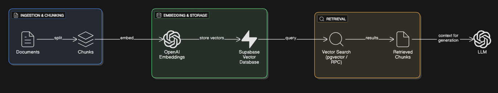

# 📚 RAG Pipeline — Retrieval-Augmented Generation System

A complete RAG (Retrieval-Augmented Generation) pipeline for processing documents, chunking content, generating embeddings, storing vectors in a database, retrieving relevant information, and producing enhanced answers with OpenAI LLMs.

This repository demonstrates every stage of a production-oriented RAG workflow — from ingestion to final conversational responses.

---
## 🚀 Features

- ✔ Text ingestion + chunking
- ✔ Embedding generation via OpenAI
- ✔ Vector storage using Supabase
- ✔ Fast semantic retrieval (k-NN)
- ✔ Answer generation with context-aware augmentation
- ✔ Modular architecture — easy to extend
---

## 🧰 Tech Stack

| Component         | Technology             |
| :---------:       | :--------------------: |
| Runtime           | Node.js                |
| LLM               | OpenAI API             |
| Embeddings        | text-embedding-3-small |
| Pipeline Tools    | LangChain              |

---

## 🔧 Installation

1. **Clone + install**

```
git clone https://github.com/HelenYarmak/rag-pipeline-with-supabase
cd rag-pipeline-with-supabase
npm install
```

2. **Environment variables**
Create ```.env``` file in the project root:
```
OPENAI_API_KEY=your_key_here
SUPABASE_API_URL=https://your-project.supabase.co
SUPABASE_API_KEY=your_service_role_key
```

---

## 📄 Workflow Overview



1. **Chunking**

Splits documents into embeddings-friendly chunks. The core of chunking lay in 
```openai.service.js```

```
const splitter = new RecursiveCharacterTextSplitter(config.chunking);

export async function splitDocument(text) {
    return splitter.splitText(text)
}
```
I tested the pipeline on Airbnb FAQ data contained in ```text.txt```, but you can run it on any text of your choice.

For chunking you should call ```ingestDocument('./text.txt')``` in ```ingest.js``` directly.

2. **Embedding Generation**

Creates vector embeddings.

```
export async function createEmbedding(text) {
    const response = await client.embeddings.create({
        model: config.openai.embeddingModel,
        input: text,
        encoding_format: 'float'
    });
    
    return response.data[0].embedding;
}

export async function createEmbeddings(texts) {
    return Promise.all(texts.map(text => createEmbedding(text)));
}

```

3. **Vector Store — Supabase Setup**

Create your project in Supabase. In SQL Editor run code:

```
create table airbnb_table (
  id serial primary key,
  text text not null,
  embedding extensions.vector(1536)
);
```

Where ```airbnb_table``` is the name of the table.

It is also important to add ```pgvector``` extension inside your Supabase project!

This function formats chunk data and inserts embeddings into a Supabase table.

```
export async function insertEmbeddings(data) {
  const formatted = data.map(item => ({
    text: item.text,
    embedding: item.embedding
  }));

  const { error } = await supabase
    .from('airbnb_table')
    .insert(formatted);

  if (error) throw error;
  return true;
}
```

4. **Retrieval**

After that you can create semantic text matching function in SQL Editor. This SQL query performs a K-Nearest Neighbors (KNN) similarity search on stored embeddings. It compares each vector in ```airbnb_table.embedding``` against the ```query_embedding```, calculates a similarity score, and returns the most relevant results.

```
create or replace function match_text (
  query_embedding vector(1536),
  match_threshold float,
  match_count int
)
returns table (
  id bigint,
  content text,
  similarity float
)
language sql stable
as $$
  select
    airbnb_table.id,
    airbnb_table.text as content,
    1 - (airbnb_table.embedding <=> query_embedding) as similarity
  from airbnb_table
  where 1 - (airbnb_table.embedding <=> query_embedding) > match_threshold
  order by similarity desc
  limit match_count;
$$;
```

How it works:
    1. Compute the vector distance using the ```<=>``` operator (cosine or L2 distance depending on the index type).
    2. Convert distance to similarity using:
```
similarity = 1 - (embedding <=> query_embedding)
```
Higher similarity → more relevant match.
    3. Filter results above a similarity threshold to keep only meaningful matches.
    4. Sort in descending order, returning the most similar chunks first.
    5. Limit output to ```match_count``` top results.

5. **RAG Response Generation**

Once the most relevant context is retrieved, the system generates an answer using a chat completion model.
The function below sends a system prompt (context + instructions) and a user message to the LLM, then returns the model’s final response.

```
export async function chat(systemPrompt, userMessage) {
  const response = await client.chat.completions.create({
    model: config.openai.chatModel,
    messages: [
      { role: 'system', content: systemPrompt },
      { role: 'user', content: userMessage }
    ]
  });
  return response.choices[0].message.content;
}
```

What this step does:

1. Packages the retrieved text as system context.
2. Sends both context + user query to the LLM.
3. The model generates a natural-language answer.
4. The first choice returned is passed back to the user.